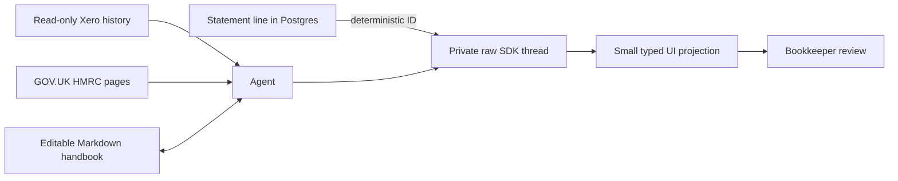

# Agent architecture

## Implemented spike

The current agent foundation is built with the first-party OpenAI Agents SDK. It runs server-side in authenticated Supabase Edge Functions and uses `gpt-5.6` with medium reasoning by default. Per-line analysis and company-wide chat share memory, Xero/HMRC research and runtime conventions. A separate deterministic controller can execute a user-accepted line recommendation; neither agent has a mutation tool.

The agent can:

- read current Xero contacts, bank accounts, posting accounts and tax rates;
- freshly search unreconciled authorised BankTransactions, open authorised bills/invoices and unresolved BankTransfers for an exact line before proposing a create or match;
- search Workbench for an equal-and-opposite statement line before proposing a transfer;
- read a bounded summary and representative examples from the last 12 months of Xero BankTransactions and Invoices;
- search GOV.UK and fetch only HTTPS pages on `gov.uk` hosts;
- list, read and update the company's private editable handbook;
- analyse one Workbench statement line and save its raw SDK thread.

The model cannot create, update or delete Xero data, prepare a candidate, or invoke a workflow transition. After a successful turn, deterministic server code records the single `needs_you` state and its run/version link. A user may then use the recommendation through a policy-checked endpoint or continue the same saved thread.

New statement lines run through a durable Postgres-backed worker. Scheduling rows contain leases, retries and progress only; they do not duplicate the agent's decision or conversation.

## Storage model

Private bucket paths:

- `{companyId}/handbook/SKILL.md`
- `{companyId}/handbook/entries/{concept}.md`
- `{companyId}/history/xero-summary.json`
- `{companyId}/threads/bootstrap/latest.json`
- `{companyId}/threads/{statementLineId}/latest.json`
- `{companyId}/threads/{bootstrap|statementLineId}/runs/{timestamp}-{runId}.json`
- `{companyId}/chats/{chatId}/latest.json`
- `{companyId}/chats/{chatId}/runs/{timestamp}-{runId}.json`
- `{companyId}/propagation/{acceptedRunId}.json`
- `{companyId}/analysis-batches/{batchId}/snapshot.json`
- `{companyId}/documents/{statementLineId}/{documentId}-{safeFilename}`

There is intentionally no agent decision, message or evidence table. The raw line thread is how a user inspects the reasoning now and how a later tax/DD audit export can reconstruct it. `latest.json` is a replaceable UI pointer; every run is also copied to an immutable run path, and a legacy latest artifact is archived before replacement. Postgres continues to own only canonical bank lines, Xero mappings, candidate preparation state and verified workflow transitions.

Company chat follows the same rule. `company_chats` is a deliberately small relational index containing company, title, creator, latest/running run pointers and failure state; messages, tool calls and decision context live only in the raw private artifact. Any current company member may list, open and continue its chats. No chat-specific roles or sharing controls are introduced in v1.

The handbook follows the editable-handbook shape: one durable concept per lowercase-kebab Markdown file, explicit provenance and limits, and a trailing `Related:` line. One-off line decisions and guesses must stay in their line thread rather than becoming company memory.

## Runtime flows

### History bootstrap

1. Fetch up to five pages each of BankTransactions and Invoices from the preceding year.
2. Store a bounded summary of contact/account/tax patterns and recent representative examples.
3. Let the agent inspect existing handbook entries and current Xero reference data.
4. Create or refine only recurring, well-supported handbook concepts.
5. Save the raw bootstrap SDK history.

### Per-line review run

1. Reconstruct reconciled movements for the mapped Xero bank account from BankTransactions, Payments and BankTransfers.
2. Attach a globally unique exact account/signed-amount/date match as already reconciled, or stop for review when the fingerprint is ambiguous. Only an unmatched line reaches the model.
3. Pass the immutable company, bank-account and statement-line snapshot.
4. Let the model selectively retrieve handbook, Xero history/reference data and HMRC guidance.
5. Require a fresh current-candidate lookup before any `create_new` or `match_existing` proposal. Invoice candidates use an optimised Xero filter for direction, authorised status and exact outstanding amount, ordered newest-first; they do not depend on a bounded prefix of the organisation's complete invoice list.
6. Return a typed display projection: operation, candidate kind, optional exact existing-Xero identity, valid Xero identifiers/codes, evidence and questions.
7. If the turn identifies an exact existing Invoice or BankTransaction and that live candidate reports attachments, server code revalidates the entity, downloads bounded supported PDF/image evidence, archives private snapshots and requires a tool-free document inspection turn whose revision cites document evidence. This also applies when the provisional operation is `request_information`, avoiding a circular request for a file that is already in Xero.
8. Save the input, projection and full replay-ready SDK history at the line path. File bytes become company-scoped private snapshot references; Xero attachment identity and SHA-256 hashes remain in the thread lineage.
9. Deterministically transition the current line to `needs_you`, store the resulting status version in the thread projection and make no Xero mutation.

The acceptance endpoints repeat the ledger preflight immediately before validation or creation. If a user reconciled the line directly in Xero after analysis, Workbench links that existing movement and performs no write.

### Durable batch runner

1. CSV or bank-feed ingestion writes an `ingestion_run_id` on newly inserted canonical lines. Marking the run complete creates a batch and its line jobs in the same database transaction.
2. A fast Edge Function kick reduces latency; a once-per-minute `pg_cron` call authenticated by a Vault-held secret provides durable recovery.
3. The claim RPC repairs expired leases, orders eligible companies by `last_dequeued_at`, and returns at most one FIFO job per company. A company cannot hold two active leases, while different companies may run concurrently.
4. The first job in a batch reads date-bounded Xero BankTransactions, Payments and BankTransfers once for all batch lines. The preflight matches locally against that ledger; the same raw BankTransactions and BankTransfers are then reused in a six-hour immutable snapshot with reference data and open invoices. Later jobs score candidates against that artifact. Xero request count therefore scales with returned pages, not statement-line count, and the ledger collections are not fetched twice.
5. Each job rechecks the line status/version before and after snapshot creation. Changed, prepared or reconciled lines are skipped; automatic analysis never overwrites user work or an existing recommendation.
6. A Xero 429 defers the whole company's queue until the provider's `Retry-After` time and does not consume the line's bounded retry budget.
6. A batch run can read the free-form company handbook but cannot write it. Only explicit user conversations can create company memory.
7. The immutable run artifact is written before its workflow projection and republished as `latest.json` after the projection succeeds. Retry recovery detects a prior run carrying the same job ID, avoiding a second model call after a lost worker response.
8. Failures use exponential backoff and become terminal after five attempts. A failed job does not block later eligible jobs in that company. The feed shows batch counts and a temporary `Analysing` operational indicator without adding another bookkeeping state.

### Same-thread follow-up

1. Require the latest run ID and exact current statement-line version.
2. Append the user's message to the prior replay-ready SDK `history`; do not create a parallel message table or new conversation.
3. Give the agent the same read-only tools and require both a direct `reply` to the latest turn and the complete current recommendation, with fresh mutable Xero checks where relevant. A purely explanatory question preserves the prior recommendation fields and summary.
4. Save a new immutable run artifact containing `parentRunId`, `userMessage` and the full resulting history. An unresolved line advances its deterministic `needs_you` projection; a `prepared` or `reconciled` line keeps that authoritative workflow state and treats the turn as post-decision review.

The UI renders the line as one conventional chronological chat. The API projects every immutable run artifact into explicit agent/user/document messages, recommendations appear inline in the relevant agent message, and preparation/reconciliation appear once as compact system messages. The panel opens scrolled to the latest item while chat and document upload remain fixed at the bottom. The latest answer is rendered as an agent reply rather than replacing the recommendation; changed prior recommendations remain visible in lineage. The full raw thread remains available for investigation and later audit exports.

### Company chat

1. The first message creates a minimal `company_chats` row and immediately opens that chat in the company Chats tab.
2. The authenticated streaming endpoint reserves one run for the chat, reads the prior raw artifact and appends the latest user turn to its replay-ready Agents SDK history.
3. The agent may read/write the company handbook, read Xero reference data and bounded history, search/fetch GOV.UK HMRC guidance, inspect company setup and search or expand Workbench statement lines. It has no operational or Xero write tool.
4. The response streams to the AI Elements conversation UI. On completion, the full history and a compact visible-message projection are written to immutable and latest private paths before the database pointer is advanced.
5. A chat opens at the bottom and its composer remains fixed. Starting a new chat from Reconcile or Settings navigates to Chats; while a statement-line panel is open, that line's composer takes precedence.

### Handbook change propagation

Handbook updates made during an explicit bookkeeper conversation are active immediately; they are already user-originated and do not require a second approval record. Preparing that line is a stable trigger for applying the new knowledge elsewhere, not the approval boundary for the memory itself.

1. After either reviewed create or reviewed match reaches `prepared`, the server inspects the accepted raw SDK history for `upsert_handbook_entry` calls and resolves the current Markdown content of those entries.
2. One low-reasoning relevance call screens only unresolved lines (`new` or `needs_you`, with no active candidate) in the same bank account. It defaults to no and may identify relevance only; it cannot choose or execute accounting treatment.
3. Each selected line is re-fetched and skipped if its status version changed after screening. Selected lines are rerun sequentially through the normal read-only line agent with handbook read access and no handbook-write tool.
4. The resulting run carries `reconsideration` provenance (source run/line, changed entries and screening reason) and appears in chat after a system message headed “Revisited after company memory changed”. It is never presented as a message from the user on that target line.
5. The fresh recommendation still requires `Use this recommendation`; propagation has no Xero mutation capability and never inherits the source line's approval.
6. A private `{acceptedRunId}.json` job artifact makes scheduling idempotent, records per-target results and lets an authenticated repair endpoint resume jobs for accepted runs that predate the trigger. A target already carrying the same source run is not rerun.

The first live backfill used the approved `tracey-small-professional-fees` entry. The screener selected a £300 Tracey line as materially affected, left a £3,000 Tracey line untouched because it exceeded the rule's bound, and produced a fresh review-only Consulting (412), `NONE` recommendation with visible provenance.

### Same-thread document evidence

1. The bookkeeper obtains the requested supplier document outside Workbench and uploads a PDF, PNG, JPEG or WebP (maximum 10 MB) in the line panel.
2. An authenticated Edge Function validates membership, line/run/version, content type and size; hashes the bytes; deduplicates the upload; stores it in the private `agent-artifacts` bucket and returns immediately.
3. A bounded background task appends the actual PDF or image to the prior Agents SDK history as model input. The document turn receives a fresh current-Xero candidate snapshot, uses one low-reasoning structured model turn and must check supplier, date, currency, total and VAT evidence.
4. Persisted replay history replaces inline base64 with a durable `workbench://document/{id}` reference. Later follow-ups resolve that reference privately before calling the model, so document bytes do not become a database record or get copied into every thread artifact.
5. Postgres stores only document storage, analysis and Xero-sync metadata. The raw thread remains the explanation/audit trail.
6. When the user approves a create recommendation, the deterministic writer first commits the Xero entity and local GUID mapping, then uploads all analysed line documents to that exact Xero Invoice, BankTransaction or BankTransfer. A document uploaded after preparation is attached to the mapped entity immediately after analysis. Attachment filenames include the document ID; retries first recover an existing filename/size match. Older Xero connections missing `accounting.attachments` require one OAuth reauthorisation, after which the callback retries pending documents automatically. A partial attachment failure is recorded on the document; it never causes a second accounting entity to be created.
7. The line panel polls document state while work is fresh. A task that fails or exceeds its bounded processing window becomes a document-local `Analysis interrupted` state with `Retry analysis`; it never surfaces as a recommendation error or leaves the UI permanently busy.

## First real-company evaluation — 27 July 2026

The initial spike bootstrapped Boringbits Limited from its real connected Xero history and produced private threads for the ten most recent imported Starling lines. Those baseline runs predated the minimal review-state projection; new and rerun analyses now move to `needs_you` without changing Xero.

Outcome distribution:

- 3 `recommend_candidate`;
- 7 `needs_information`;
- 0 automatic preparations.

Useful observed behaviour:

- recurring payroll-like payments and a Microsoft subscription were mapped to valid current Xero contacts/account codes;
- ambiguous payments to the same person were not collapsed into one rule when history contained payroll, director-loan, dividend and expense treatments;
- subscription and fuel cases requested invoices/receipts where supplier location, business purpose or VAT treatment could change the accounting;
- the Dishpatch receipt detected likely settlement of an existing authorised invoice and warned that creating receive-money revenue could duplicate revenue and VAT.

The run exposed one important missing contract: `candidateKind: invoice` alone could not communicate that the correct action was to match a specific existing invoice rather than create one.

## Create-vs-match comparison — 27 July 2026

The output contract includes `proposedOperation` (`create_new | match_existing | request_information | human_review`) plus an optional existing entity type, GUID, number and match rationale. It deliberately has no numeric certainty score: a model-generated percentage is not a calibrated accounting control. Deterministic validation and explicit user approval decide whether a recommendation can be used.

The same ten lines were rerun. Prior latest artifacts were archived immutably before the new results were saved.

Second-run distribution:

- 3 `create_new`;
- 1 `match_existing`;
- 6 `request_information`;
- 0 `human_review`;
- 0 automatic preparations or Xero/status changes.

The key proof was the £4,200 Dishpatch receipt: the fresh lookup returned authorised sales invoice `INV-0361` and its exact Xero GUID. The agent produced `match_existing` from exact amount, customer and statement-reference agreement. The first run could only describe that possibility without identifying the entity.

Compared with the baseline, Oakhill moved from information-needed to a conservative no-VAT recurring spend, while Microsoft moved from a recurring spend recommendation to information-needed because supplier location/VAT could vary. This confirms that document policy and future autonomy controls need evaluated outcomes, deterministic boundaries and review history rather than a model-generated score.

The fresh candidate search made the browser-orchestrated ten-line sequence take roughly five minutes. The implemented runner now caches one tenant snapshot per batch and resumes each line independently.

## Reviewed match execution — 27 July 2026

The first execution boundary is implemented for `match_existing` bills, invoices and bank transactions. The browser submits only company ID, line ID, saved run ID and statement-line version. Server code then:

1. verifies membership, blocking accounting settings, bank mapping, latest raw-thread run ID and the exact input line version;
2. freshly searches current Xero candidates and fetches the selected GUID directly;
3. rejects stale, non-`AUTHORISED`, already-reconciled, amount/direction/currency/account mismatches, uncorroborated identity, equally strong duplicates and locally mapped entities;
4. reconstructs and fingerprints an immutable validated intent without trusting a browser- or model-authored Xero payload;
5. atomically stores the minimum candidate/Xero GUID mapping, links the run and fingerprint in the transition event, and moves the line to `prepared` without creating anything in Xero.

The raw agent thread remains the decision/audit artifact. No decision or evidence table was added. Existing-transfer matching stays non-executable until the agent contract identifies both statement-line sides.

## Reviewed create execution — 27 July 2026

The reviewed execution boundary also supports new BankTransactions and authorised bills/invoices. The browser submits only company ID, line ID, saved run ID and statement-line version. Server code then:

1. verifies company setup, bank mapping, latest thread identity and line version;
2. freshly searches Xero and rejects creation when a strong compatible existing candidate has appeared;
3. re-fetches active Xero contacts, posting accounts and tax rates and rejects any stale or incomplete identifier in the saved recommendation;
4. reconstructs the candidate payload server-side, including the recommended tax type and, for bills/invoices, explicit document date, due date and supplier/customer document number; Xero `InvoiceNumber` remains separate from the Workbench correlation marker in `Reference`, then hands the result to the existing reservation/idempotency/recovery writer;
5. leaves reconciliation to a later authoritative Xero observation.

The line panel intentionally contains no manual entity/contact/account/tax form. It is one chronological chat with `Use this recommendation` inside the latest relevant agent message and a fixed same-thread message/document composer in every state. Prepared and reconciled follow-ups cannot reopen the workflow or create a duplicate entity. For an existing Xero match, the panel securely lists attachment metadata already on that exact entity and identifies files the agent actually inspected. Analysed Workbench documents are attached automatically when either a create or existing match is approved, or immediately when the mapped Xero entity already exists. Oakhill was visually verified with both controls; a real follow-up asking why no VAT returned a direct answer in the same thread without writing to Xero.

## Next derisking steps

1. Add an open-banking provider at the existing ingestion-run boundary and prove a new feed entry reaches review without a browser session.
2. Add malware scanning/quarantine before accepting arbitrary production documents.
3. Add cancellation plus cost/latency metrics to the durable runners, and tune worker concurrency from observed production limits.
4. Extend the recommendation contract and deterministic execution boundary to two-sided transfers.
5. Build a labelled evaluation set from naturally reviewed real threads, then define operation-specific autonomy policy; remain review-only meanwhile.
6. Design an export format that renders the raw thread, document provenance, tool evidence and Xero outcome for tax/DD audit requests.

## Durable Xero observation

The observation runner reuses the analysis runner's Vault-authenticated cron trigger, self-chaining Edge Function, expiring leases, bounded retries and least-recently-dequeued company ordering. Its work item is deliberately company-scoped rather than line-scoped: one fresh Xero session checks every active candidate, recently settled candidates whose last observation is at least 30 minutes old, and open lines with no Workbench candidate. A daily full sweep includes older settled candidates so later reversal remains observable.

Candidate observations still commit through `apply_candidate_observation`; direct Xero reconciliations still commit through `commit_observed_xero_reconciliation`. Repeated identical observations update Xero evidence timestamps but do not increment statement-line versions or emit duplicate line events. The browser only schedules an immediate run and reads its operational projection.

Live validation on 28 July 2026 used BORINGBITS LIMITED. The initial full sweep observed six settled candidates and 18 open unmatched lines, completed on its first attempt and normalized one older line note. An immediate identical sweep produced zero further line changes. The next cron-only run was recorded with `source=scheduled`, checked all 18 open lines, produced zero changes and skipped the six settled candidates because their observations were inside the 30-minute throttle window.
