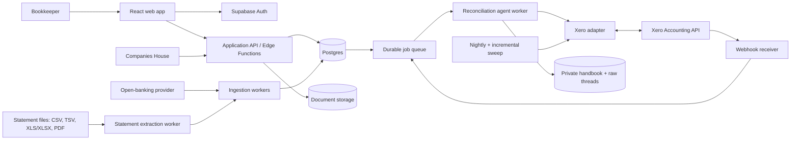

# Architecture

The runnable vertical slice implements these boundaries in `src/` and `supabase/`. Sections describing durable workers, open banking, document processing and the reconciliation agent remain the target architecture for subsequent slices.

## System context



## Architectural boundaries

### Web application

- Vite + React + TypeScript.
- Reads company/feed/thread projections through authenticated APIs.
- Sends commands (`submit_decision`, `upload_document`, `request_candidate_change`) rather than writing statuses.
- Defaults incomplete companies to Settings and explains the next readiness steps.
- “Open Xero to accept” is a plain external link. It never updates local state.

### Application API

- Authorisation, validation and command handling.
- Company is the v1 tenancy boundary; access is the direct user-to-company membership relation.
- Creates the company immediately after Companies House selection.
- Manages company-scoped invitations.
- Calculates setup readiness from Xero, bank and accounting-setting records.
- Accepts authenticated bookkeeper document uploads into private object storage and records only the minimum storage/analysis/Xero-sync metadata in Postgres.
- Runs Xero's confidential authorization-code flow in Edge Functions; OAuth state is single-use, refresh tokens are encrypted in Supabase Vault and rotated server-side, and `accounting.attachments` is requested so supporting evidence can be sent without a separate user action.

### Ingestion

- Provider adapters normalize posted UK bank transactions into a canonical GBP statement-line envelope.
- Webhooks are acknowledged quickly, stored idempotently and processed asynchronously.
- Provider retries and duplicate deliveries are collapsed in the ingestion-record layer before a canonical statement line is committed.
- Every canonical statement line is bookkeeping work and must reach reconciliation; suspected source duplication is an ingestion-integrity incident, not an accounting disposition.
- Statement upload is one format-agnostic flow for CSV, TSV, XLS/XLSX and PDF. There is no column-mapping or row-editing path: a vision-capable model reads the source into a typed full-ledger proposal, while deterministic code proves dates, GBP integer amounts, statement controls and running-balance continuity where the source exposes them.
- CSV/TSV content and every XLS/XLSX worksheet are expanded server-side and sent in full rather than through a capped spreadsheet augmentation. A tabular source that exceeds the explicit safe context budget fails and asks for a shorter statement period; it is never silently truncated. PDFs are supplied as visual files. Sources without printed balance controls require two independent extractions with an exact normalized transaction-set agreement.
- The immutable original, SHA-256, typed extraction, validation checks and source locators are stored privately. No canonical line is written when any verification fails.
- The first verified file for an account pauses for a simple detected-account-to-Workbench-account confirmation. Later exact account-identity matches can commit without another mapping step.
- Commit is one database transaction. Semantic dedupe compares normalized date, signed amount, payee, description and reference against all existing lines—even those created by the retired importer—and uses multiplicity so two genuinely identical rows on one statement remain two bookkeeping lines.
- Completing an ingestion run transactionally enqueues only newly inserted lines on the existing fair durable agent runner; a replay that adds no lines schedules no agent work.
- The provider transaction ID is the first-choice identity; fingerprint fallback is explicit and auditable.

### Reconciliation agent

- The deployed spike is a first-party OpenAI Agents SDK loop running in authenticated Edge Functions.
- Retrieves read-only Xero reference data and a bounded one-year history summary, company accounting settings, free-form company handbook entries and GOV.UK-scoped HMRC guidance.
- Stores evolving memory as human-editable Markdown handbook files. It does not freeze bookkeeping knowledge into a rigid decision schema or embedding table.
- After a reviewed line is prepared, detects handbook entries changed in that accepted thread, screens unresolved same-account lines once for material relevance, and reruns only selected lines. The propagation job is idempotent, preserves newer conversations, exposes source-memory provenance in chat and cannot approve or write a Xero candidate.
- Stores the raw replay-ready SDK history at a deterministic private path for each statement line. That thread is the human-facing reasoning/audit artifact; there is no parallel database decision record.
- Produces a small typed UI projection from the raw thread so the feed can render candidate, uncertainty, evidence and questions.
- After a successful per-line run, a deterministic controller moves the line to the single `needs_you` state and records the run ID; the raw thread explains whether the required action is acceptance, information or judgement.
- A deterministic policy layer validates the current line/version, current Xero entity, amount, direction, identity, bank mapping, uniqueness, required settings and supported candidate shape before a reviewed recommendation can be prepared.
- Creates new bills and sales invoices in `AUTHORISED` state; draft or submitted invoices are not valid prepared candidates in v1. The typed recommendation carries document date, due date and supplier/customer document number. The writer maps that number to Xero `InvoiceNumber` and keeps the Workbench correlation token in Xero `Reference`.
- Can create any valid Xero candidate supported by the adapter. Unsupported or ambiguous cases enter `needs_you`.
- The model runtime exposes no Xero mutation or workflow-transition tool. Server code owns the deterministic `needs_you` projection. Authenticated acceptance endpoints can attach a freshly revalidated existing entity or create the recommended bank transaction/bill/invoice from current server-side Xero references; the model cannot invoke either endpoint itself.
- The product does not reproduce Xero's manual coding form. A line is one chronological chat, opened at its latest message, with every immutable run projected as explicit analysis/question/answer activity and workflow changes shown once as compact system messages. The agent returns a direct conversational reply separately from the complete current recommendation, so explanatory questions do not erase or masquerade as accounting decisions. The message composer and document upload remain fixed at the bottom and usable in every state.
- A bookkeeper can upload a PDF or supported image to that same line thread. The runtime gives the actual file to the model, stores only a durable private document reference in replay history, and replaces the recommendation from the resulting turn. For prepared/reconciled lines, follow-up turns preserve the authoritative state; evidence uploaded after preparation is attached automatically to the mapped Xero entity.
- Before any line is analysed, a deterministic preflight reconstructs reconciled movements for the mapped bank account from BankTransactions, Payments and BankTransfers. A unique exact account/signed-amount/date match is attached and settled without invoking the model; a non-unique or nearby-date match blocks creation as `needs_you`.

### Company agent chats

- A compact composer is fixed to the bottom of every company tab when a statement-line panel is not open. Its first message creates a company-scoped chat index and navigates to the Chats tab; the Chats tab lists prior chats and opens the selected thread at its latest message.
- The chat agent reuses the reconciliation agent's OpenAI Agents SDK runtime, current Xero reference/history readers, GOV.UK HMRC research and free-form company handbook. It can write handbook entries only when the user supplies or confirms durable company knowledge.
- Company chat exposes bounded read tools for company setup, statement-line search and detailed line context. It intentionally has no candidate-acceptance, workflow-transition or Xero-mutation tool; operational changes remain reviewed in the relevant line thread.
- Postgres stores only `company_chats` index/concurrency rows. Full messages, SDK replay history, tool activity and immutable run lineage remain in the private `{company_id}/chats/{chat_id}/...` artifacts. Company membership is the only chat-access boundary in v1; there is no chat-specific role model.
- The browser consumes the Edge Function's AI SDK data stream through AI Elements components. A run reservation prevents concurrent replies from forking one thread; the completed artifact is published before the database latest-run pointer advances.

See `AGENT_ARCHITECTURE.md` for deployed artifact paths, tool boundaries and the first real-company evaluation.

### Xero adapter

- Owns entity-specific payload construction, scopes, limits, idempotency, correlation markers and reconciliation predicates.
- Stores every returned Xero GUID locally as the authoritative mapping, including BankTransfer source/destination transaction IDs and Payment IDs discovered after reconciliation.
- Adds a compact Workbench correlation marker using a per-entity capability table.
- Supports a shared candidate set across multiple statement lines; a transfer's source and destination lines observe the same Xero object but settle independently.
- Never attempts to read or reconcile unreconciled Xero statement lines through the public Accounting API.
- Treats webhooks as invalidation hints, then fetches authoritative object state.
- Synchronizes on company-feed entry, explicit refresh, return from Xero and workflow boundaries. It does not poll Xero while nobody is using Workbench; a full reversal sweep is folded into the next on-demand run when the previous full sweep is older than 24 hours.
- Reserves the immutable accounting request, correlation marker and Xero idempotency key before any external write. A retry first searches the entity-specific marker channel and reattaches a matching orphan instead of creating a duplicate.
- Reconstructs the accessible accounting-side bank ledger from ordinary Accounting API objects. It never claims access to Xero's hidden statement-line ID: direct-reconciliation discovery requires a one-to-one exact mapped-account, signed-amount and date fingerprint, with nearby or duplicate fingerprints treated as ambiguous.
- Supporting evidence may be uploaded to any line and always continues that line's existing private agent thread. For a recommended existing match, a membership-checked server read lists attachment metadata already on the exact Xero entity. Before that recommendation is saved, the server revalidates the selected entity, retrieves bounded PDF/image evidence already attached in Xero, archives company-scoped private snapshots and requires a document-citing agent revision. The raw thread retains snapshot URIs, attachment identity and hashes rather than embedding file bytes. After either a reviewed create or existing-match commit, every analysed Workbench document is uploaded to the mapped Invoice, BankTransaction or BankTransfer; files added later are attached immediately after analysis. Each file has a deterministic Xero-safe filename; retry first lists existing attachments and reattaches the exact filename/size match. Connections made before the attachment scope was introduced show one explicit reauthorisation action; the OAuth callback automatically retries all pending documents. Other attachment failures do not pretend the accounting write failed or create a duplicate; the per-document error remains visible and can be retried against the stored Xero GUID.

Official Xero documentation currently states that unreconciled bank statement data is not exposed through public Accounting APIs and reconciliation must happen in Xero. The separate Bank Feeds API is for approved financial institutions delivering statement data, not the ordinary app integration assumed here.

## Main asynchronous flow

```mermaid
sequenceDiagram
  participant B as Bank provider
  participant I as Ingestion
  participant D as Postgres/queue
  participant G as Agent worker
  participant X as Xero adapter
  participant U as Bookkeeper

  B->>I: posted transaction
  I->>D: upsert statement line (idempotent)
  D->>G: process line
  G->>D: retrieve settings + precedents
  alt safe candidate
    G->>X: create candidate (idempotency key)
    X-->>G: Xero GUID(s) + marker result
    G->>D: commit candidate set; status=prepared
    U->>X: open Xero and reconcile there
    X-->>D: on-demand authoritative observation
    D->>X: fetch linked object(s)
    X-->>D: authoritative reconciliation fields
    D->>D: verify GUID + marker + amount + account + state
    D->>D: status=reconciled
  else decision needed
    G->>D: status=needs_you + evidence
    U->>D: decision, message or offline-obtained document
    D->>G: continue the same line thread
  end
```

## Xero correlation and observation

Do not rely on a user-visible reference as the primary key. The primary join is the locally stored tuple `(tenant_id, object_type, xero_object_id)` returned by Xero.

Defence-in-depth marker strategy:

| Xero object | Confirmed marker channels | Forward observation | Reverse observation |
|---|---|---|---|
| Invoice/bill | `Url`, optional Reference and History note all persisted in the experiment; preserve business-owned values | parent `PAID`; fetch the Payment by GUID and require `AUTHORISED`, `IsReconciled=true`, exact account/amount/date | Payment becomes `DELETED`/unreconciled and parent returns to `AUTHORISED` |
| Payment | discovered from the parent Invoice, then stored by GUID; local mapping is sufficient | `IsReconciled=true` plus exact parent/account/amount/date | `DELETED` and `IsReconciled=false` |
| BankTransaction | `Url`, optional Reference and History note all persisted | same GUID remains `AUTHORISED` and changes to `IsReconciled=true` | Remove & Redo makes the object `DELETED` and unreconciled |
| BankTransfer | Reference on BankTransfer; History note through the returned source BankTransaction; no `Url` channel observed | source and destination flags change independently; each linked line follows its side | Remove & Redo on one tested side deleted the whole transfer and cleared both flags |
| Prepayment/overpayment/credit note | History note; Reference where supported and safe | entity-specific payment/allocation state | not yet validated in the live experiment |

The adapter must preserve existing business references. If no safe Xero-side channel exists, `local_only` is valid; reliable local GUID storage is mandatory regardless. Marker channels are an array, because URL, Reference and History note can all be present on one object.

The public Accounting API does not expose the unreconciled statement-line ID or an API join from a Payment/BankTransaction back to that line. The verifier therefore proves that the exact stored accounting object is reconciled and that bank account, amount, date and parent fingerprints agree. It must not claim stronger statement-line identity than Xero exposes.

## Sync strategy

1. Entering a company feed enqueues one coalesced sync. Opening Xero records intent locally; returning focus to Workbench enqueues another sync for the company. The bookkeeper can also request one explicitly.
2. The minute worker wake is recovery infrastructure only: it claims explicitly queued or retryable jobs and performs no Xero request when the queue is empty.
3. A sync checks active candidates plus the rolling recent-settlement window. If no full sweep has run in 24 hours, that same user-triggered job also checks older settled candidates for reversals.
4. Before batch agent analysis, one date-bounded set of Xero list reads covers every imported line; the reconciled-ledger preflight and immutable agent snapshot reuse those results. Immediately before any accepted write, a fresh single-line preflight still scans reconciled BankTransactions, Payments and BankTransfer sides for the mapped account and date window.
5. A globally one-to-one exact fingerprint commits a settled local candidate set pointing at the already-existing Xero object; no Xero write occurs. Duplicate fingerprints, already-mapped objects and same-account/amount movements within seven days enter `needs_you` rather than being guessed.
6. The verifier records the exact evidence used for every `prepared → reconciled` or directly observed reconciliation transition and separately evaluates each side of a shared transfer candidate.
7. Reversed invoice/bill payments return a line to `prepared` when the authorised parent remains valid.
8. Deleted BankTransactions or BankTransfers invalidate the candidate set and reopen every affected line as `needs_you`; the old GUID remains in the audit trail and a replacement is a new attempt.
9. A Xero 429 defers the whole company observation queue until `Retry-After` without consuming the job's retry budget. Activity triggers cannot override that provider cooldown.

## Failure and consistency design

- Transactional outbox: database state change and queued work commit together.
- Inbox dedupe: provider and Xero event IDs are unique before processing.
- External writes: reserve the candidate attempt before calling Xero; persist one UUID idempotency key and the SHA-256 accounting-intent fingerprint; search the stored marker before retrying a write whose outcome is not locally committed.
- Xero's native idempotency cache protects immediate retries for only six minutes. Durable recovery therefore uses an exact Reference lookup followed by amount, date, type and account fingerprint verification before the atomic local commit.
- `commit_xero_preparation` stores every returned GUID, activates every linked statement line, appends line events and enqueues observation in one database transaction. A crash before that transaction leaves the candidate `recovery_needed`, never falsely `prepared`.
- Leases: crashed workers do not strand `processing` lines.
- Circuit breakers: pause writes per Xero tenant on auth, permission or rate-limit failures.
- Backpressure: separate queues for ingestion, agent reasoning, Xero writes and Xero observation.
- Reconciliation invariants: GUID mapping, bank account, signed amount/currency and candidate fingerprint must agree.
- Shared-candidate invariant: transfer-side transitions lock and update both candidate memberships so deletion cannot leave one line falsely reconciled.
- Human-visible failures: integration-level failures appear in Settings; line-level failures appear in the line thread.

## Security and compliance baseline

- Supabase RLS enforces direct company membership; invitations grant one company only.
- OAuth refresh tokens use a secrets manager/envelope encryption and are never exposed to the browser.
- Documents are private, size/content-type checked and read only by authenticated server functions. Malware scanning is required before production use.
- Logs, model traces and raw thread access omit OAuth tokens and unnecessary document content; retention and redaction policy must be explicit before production autonomy.
- Model prompts receive the minimum company/line context required; retention and deletion policies cover prompts and extracted documents.
- Every accounting write and state transition has an immutable database audit record. Agent reasoning and retrievals remain in the corresponding immutable/raw thread artifact, referenced by deterministic company/line path.

## Delivery slices

1. Company creation and resumable Settings readiness.
2. One open-banking adapter on top of the implemented format-agnostic statement importer; feed ingestion and dedupe.
3. Needs-you decision with a fake Xero adapter.
4. Real BankTransaction preparation and observation.
5. Bills/invoices/payments and transfers with entity-specific verification.
6. Offline-obtained document upload, model inspection, resumed reasoning and Xero attachment sync (implemented; malware scanning remains).
7. Decision-memory retrieval, HMRC corpus and agent evals.

The live UK demo-company results behind these constraints are recorded in `XERO_CAPABILITY_MATRIX.md`.

## Current external references

- Xero Accounting API bank-statement constraint: https://developer.xero.com/documentation/api/accounting/bankstatements
- Xero History & Notes supported documents: https://developer.xero.com/documentation/api/accounting/historyandnotes
- Xero Payments and `IsReconciled`: https://developer.xero.com/documentation/api/accounting/payments
- Xero Bank Transfers reconciliation flags: https://developer.xero.com/documentation/api/accounting/banktransfers
- Xero invoice fields and status: https://developer.xero.com/documentation/api/accounting/invoices
- Xero webhook categories and delivery rules: https://developer.xero.com/documentation/guides/webhooks/overview/
- Xero API scopes: https://developer.xero.com/documentation/guides/oauth2/scopes/
- Xero Accounting API attachments: https://developer.xero.com/documentation/api/accounting/attachments

These are implementation inputs, not frozen truths. The adapter capability tests and release checklist must detect API changes.
