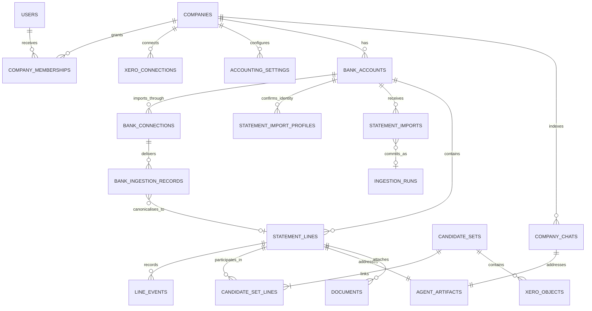

# Data model

The executable schema is the ordered migration set under `supabase/migrations/`. This document explains the resulting model and its invariants, including the later agent, conversation, document and provider-ingestion tables.

## Relationship diagram

## Identity and tenancy

### `users`

- `id uuid primary key` — Supabase Auth user ID
- `display_name text not null`
- `email citext not null`
- timestamps

### `companies`

- `id uuid primary key`
- `companies_house_number text not null`
- `legal_name text not null`
- `registered_office jsonb`
- `country_code text not null check (country_code = 'GB')`
- `base_currency text null check (base_currency is null or base_currency = 'GBP')`
- `last_opened_bank_account_id uuid null`
- `created_by uuid not null`
- timestamps

Company is the v1 tenancy and access boundary. Users see the union of companies granted through `company_memberships`. A company row is a product tenancy, so the same Companies House number is not globally unique; adding a grouping layer later does not require changing company-scoped foreign keys.

`setup_status` is computed from connection/settings data; do not persist a manually editable copy.

### `company_memberships`

- `company_id uuid not null`
- `user_id uuid not null`
- `role text not null check (role = 'bookkeeper')`
- `invited_by uuid not null`
- `accepted_at timestamptz null`
- timestamps
- primary key `(company_id, user_id)`

Invitations are company-scoped records with single-use tokens, normalized email, expiry and acceptance audit.

## Setup and integrations

### `xero_connections`

- `id uuid primary key`
- `company_id uuid not null`
- `tenant_id text not null`
- `status text` — `authorising | connected | refresh_failed | disconnected`
- encrypted refresh-token reference; never store plaintext tokens in ordinary columns
- `scopes text[]`
- `connected_by uuid`
- `last_successful_sync_at`, `last_error_at`, `last_error_code`
- timestamps
- unique active tenant per company

### `accounting_settings`

- `company_id uuid not null`
- `key text not null`
- `value jsonb null`
- `source text` — `xero | user`
- `required_level text` — `company_blocking | workflow_blocking | advisory`
- `xero_updated_at`, `confirmed_by`, `confirmed_at`
- primary key `(company_id, key)`

Expected v1 keys include `vat_registered`, `vat_scheme`, `financial_year_end`, and later workflow-specific CIS settings.

### `bank_accounts`

- `id uuid primary key`
- `company_id uuid not null`
- `display_name text not null`
- `currency text not null check (currency = 'GBP')`
- `account_fingerprint text not null` — salted provider-neutral hash, not raw account number
- `xero_account_id text null`
- `status text` — `pending | active | paused | disconnected`
- timestamps

### `bank_connections`

- `id uuid primary key`
- `bank_account_id uuid null` until provider returns accounts
- `company_id uuid not null`
- `provider text not null` — provider adapter key or `csv`
- `provider_connection_id text`
- `status text` — `link_created | consent_pending | active | expired | failed | revoked`
- token hash/expiry for generated consent link; never store a reusable raw token
- consent and sync timestamps/errors

### `bank_ingestion_records`

- `id uuid primary key`
- `bank_connection_id uuid not null`
- `provider_event_id text null`
- `provider_line_id text null`
- `dedupe_key bytea not null`
- `canonical_statement_line_id uuid null`
- `disposition text` — `accepted | duplicate_delivery`
- encrypted/access-controlled raw provider payload and received timestamp
- unique provider event/line constraints where the provider guarantees identifiers

This is an ingestion/audit envelope, not a bookkeeping line. Replayed or duplicate provider deliveries point at the same canonical statement line. They do not create a second line with a terminal “ignored” status.

### `statement_imports`

- immutable private file reference, filename, MIME type, byte size and SHA-256
- `status` — `queued | processing | retryable | awaiting_confirmation | complete | failed`
- lease token/expiry, attempt count and next-available timestamp for the company-fair worker
- detected institution, account name/identifier, statement period and balances
- full typed extraction plus deterministic validation checks/warnings
- transaction/imported/duplicate counts and the committed `ingestion_run_id`

The row is scheduling and source-integrity metadata, not a bookkeeping decision log. `commit_statement_import` locks the target bank account, computes normalized transaction multiplicity against the existing ledger and atomically writes only novel canonical lines. Files that fail validation write none.

### `statement_import_profiles`

- one confirmed detected statement identity per Workbench bank account
- institution, account name and account identifier
- confirming user and timestamp

This is not a column map. It remembers only that a source statement identity belongs to the selected account so later files can commit without repeated confirmation.

## Statement lines and workflow

### `statement_lines`

- `id uuid primary key`
- `bank_account_id uuid not null`
- `provider_line_id text null`
- `provider_revision text null`
- `dedupe_key bytea not null`
- `posted_at date not null`
- `amount_minor bigint not null` — signed pence
- `currency text not null check (currency = 'GBP')`
- `payee text null`, `description text not null`, `reference text null`
- `status statement_line_status not null`
- `status_version bigint not null default 0` — optimistic concurrency
- `processing_locked_by text null`, `processing_lease_expires_at timestamptz null`
- `active_candidate_set_id uuid null`
- `reconciled_at timestamptz null`
- timestamps
- unique `(bank_account_id, dedupe_key)`

`active_candidate_set_id` is a read-optimised pointer and must agree with an active `candidate_set_lines` membership; the join table is the relational source of truth. The dedupe key should prefer the provider's immutable transaction ID. The fallback combines account, posted date, signed amount, normalized description/reference and a provider occurrence discriminator. Every committed statement line is canonical and must eventually reach `reconciled`; personal/director transactions are coded to an appropriate account rather than removed.

### `line_events`

- `id uuid primary key` — supplied idempotency/event ID
- `statement_line_id uuid not null`
- `event_type text not null`
- `actor_type text` — `user | agent | system | xero | provider`
- `actor_id text null`
- `from_status`, `to_status`
- `request_id text`, `causation_event_id uuid null`
- `payload jsonb not null`
- `created_at timestamptz not null`

Append-only. Application roles may insert, never update/delete.

### `candidate_sets`

- `id uuid primary key`
- `company_id uuid not null`
- `attempt_number int not null`
- `status text` — `building | active | settled | reversing | reversed | invalidated`
- `candidate_kind text`
- `preparation_state text` — `creating | created_in_xero | recovery_needed | committed`
- `preparation_request jsonb not null` — immutable server-built Xero endpoint/payload intent, with the allocated marker stored separately
- `preparation_fingerprint text not null` — SHA-256 of the immutable accounting intent
- `xero_idempotency_key text not null unique` — one persisted UUID; constrained to Xero's accepted header length
- `xero_write_started_at`, `xero_write_succeeded_at`
- `recovery_attempts int not null default 0`, `last_preparation_error text null`
- timestamps

A candidate set is not owned by one line: a transfer is one shared set linked to source and destination statement lines. `active` includes partially reconciled multi-line sets; `settled` means every required linked line currently passes verification.

`reserve_xero_preparation` locks the statement lines and either returns their existing live reservation or creates exactly one `building` attempt. `commit_xero_preparation` is the only transition that inserts the Xero GUID rows, marks all member lines `prepared`, sets their active pointer, appends audit events and writes the observation outbox event. This transaction is idempotent if its response is lost.

### `candidate_set_lines`

- `candidate_set_id uuid not null`
- `statement_line_id uuid not null`
- `role text not null` — `primary | transfer_source | transfer_destination | related`
- `required_for_settlement boolean not null default true`
- `side_fingerprint jsonb not null` — expected bank account, signed amount, posted date, currency and provider-line identity
- `verification_status text` — `prepared | reconciled | invalidated`
- `verified_at timestamptz null`
- primary key `(candidate_set_id, statement_line_id)`
- unique active membership per statement line via a partial/exclusion constraint over the parent set status

For a transfer, each line can move from `prepared` to `reconciled` independently as Xero's corresponding side flag changes. Deletion of the shared BankTransfer invalidates both memberships atomically.

### `xero_objects`

- `id uuid primary key`
- `candidate_set_id uuid not null`
- `xero_connection_id uuid not null`
- `object_type text not null` — adapter enum such as `bank_transaction`, `bank_transfer`, `invoice`, `payment`, `prepayment`, `overpayment`, `credit_note`
- `object_role text not null` — `primary`, `source_transaction`, `destination_transaction`, `parent_document`, `payment`
- `xero_object_id text not null`
- `correlation_token text not null`
- `correlation_channels text[] not null default '{}'` — any of `url | reference | history_note | local_only`; the experiment confirmed that several channels can coexist
- `xero_status text`, `is_reconciled boolean null`
- `reconciliation_state jsonb not null default '{}'` — entity-specific evidence such as transfer side flags or payment/parent status
- `expected_fingerprint jsonb not null`
- `last_observed_payload jsonb`, `last_observed_at`
- `invalidated_at`, `invalidation_reason`, `deleted_at`, timestamps
- unique `(xero_connection_id, object_type, xero_object_id)`

For `invoice` objects, `expected_fingerprint` records `expected_status: AUTHORISED`; draft or submitted invoices cannot make a candidate set active in v1. A Payment created by Xero during reconciliation is inserted as a newly discovered `xero_objects` row and linked to the existing candidate set. Keep deleted Payment and BankTransaction rows for audit rather than overwriting or removing their GUID mappings.

## Conversation, memory, documents and reasoning

### `agent_analysis_batches`, `agent_analysis_jobs`, `agent_analysis_org_queue`

These are operational queue projections, not decision records. A batch links one ingestion run or manual backfill to a private Xero snapshot. Jobs contain the statement-line/version key, lease, attempts, backoff, terminal outcome and resulting raw-thread run ID. The organisation queue stores only fair-dequeue state (`last_dequeued_at`, active lease and next eligibility).

`xero_observation_jobs` and `xero_observation_org_queue` reuse the same operational pattern for Xero state polling. An observation job covers one company and stores only lease/retry counters and a compact result summary. The company queue records due time, last success/full sweep and the latest error. Accounting evidence and transitions remain in `xero_objects`, `candidate_sets`, `line_events` and the statement line itself.

The database enforces one job per `(statement_line_id, expected_status_version)`. Claiming selects companies by oldest dequeue time and then the oldest eligible job inside each company, with `FOR UPDATE SKIP LOCKED`. One active lease per company serializes Xero refresh-token use; different companies can be processed concurrently. No recommendation, explanation, user message or evidence is copied into these tables.

Agent content is not normalized into `threads`, `messages`, decision or evidence tables in v1. Private object storage is the source of truth for agent conversation content, addressed deterministically so no relational message or decision record is required:

- `{company_id}/handbook/SKILL.md`
- `{company_id}/handbook/entries/{lowercase-kebab-concept}.md`
- `{company_id}/history/xero-summary.json`
- `{company_id}/threads/bootstrap/latest.json`
- `{company_id}/threads/{statement_line_id}/latest.json`
- `{company_id}/threads/{bootstrap|statement_line_id}/runs/{timestamp}-{run_id}.json`
- `{company_id}/chats/{chat_id}/latest.json`
- `{company_id}/chats/{chat_id}/runs/{timestamp}-{run_id}.json`
- `{company_id}/documents/{statement_line_id}/{document_id}-{safe_filename}`

The raw line artifact contains the input snapshot, model, timestamp, run ID, structured UI projection, response identifiers and replay-ready SDK history including tool calls/results. `latest.json` is only a UI pointer; immutable run paths retain every rerun. Handbook entries are free-form, human-editable Markdown with one concept per file, provenance and a trailing `Related:` line. Service-backed APIs authorize artifact reads; the bucket is private and has no browser policy.

If later product use needs search, retention or unread projections that deterministic paths cannot support efficiently, add a derived index over these artifacts. Do not make that index a second source of truth for the decision.

### `company_chats`

- `id uuid primary key`, `company_id uuid not null`, `created_by uuid not null`
- short display `title` derived from the first user message
- `latest_run_id uuid null` and `running_run_id uuid null`
- compact `last_error text null`, timestamps and company/updated index

This is a navigation, concurrency and recovery index only. It has no message text, generated answer, tool call or accounting decision. Row-level access is inherited solely from company membership; chat-specific roles are intentionally absent. The reserve/finish/fail RPCs are service-only so two browser requests cannot fork one saved conversation.

### `documents`

- `id uuid primary key`
- `company_id uuid not null`
- `statement_line_id uuid null`
- `storage_key text not null`
- filename, MIME type, byte size, SHA-256
- `source text` — currently `user_upload`
- agent analysis status/error and the run/candidate set that used it
- Xero object type/GUID, attachment filename/GUID, upload timestamp and retryable error
- uploaded-by/timestamps

This table is deliberately synchronization metadata, not a normalized evidence or decision log. The private raw thread remains the explanation/audit artifact. The bookkeeper obtains documents offline and uploads them to the line thread; PDF/PNG/JPEG/WebP files are capped at 10 MB. On a reviewed create, analysed files are sent to the created Xero entity. An OAuth scope upgrade automatically retries pending files; other failures are retained for explicit retry. Malware scanning is still required before production use.

## Security and invariants

- Row-level security requires an accepted company membership for every company-scoped read or write. Service operations still carry and validate `company_id` explicitly.
- Service workers use narrowly scoped database roles; browser clients cannot write workflow statuses or Xero object mappings directly.
- Money is integer minor units plus ISO currency; never floating point.
- External tokens and document contents are encrypted and omitted from logs.
- Every external write uses an idempotency key and records the request/response envelope with sensitive fields redacted.
- Foreign keys use restrictive deletion for accounting/audit records. User-facing deletion is soft deletion plus retention policy.
- Candidate and status commits use a database transaction with optimistic `status_version` checks.

## Recommended indexes

- statement feed: `(bank_account_id, posted_at desc, id desc)`
- work queue: `(status, processing_lease_expires_at)` where status in `new, processing`
- needs-you counts: `(bank_account_id, status)`
- provider dedupe: `(bank_account_id, provider_line_id)` where provider line ID is not null
- Xero polling: `(xero_connection_id, object_type, last_observed_at)`
- artifact discovery is by deterministic object path; no decision embedding index is required in v1
