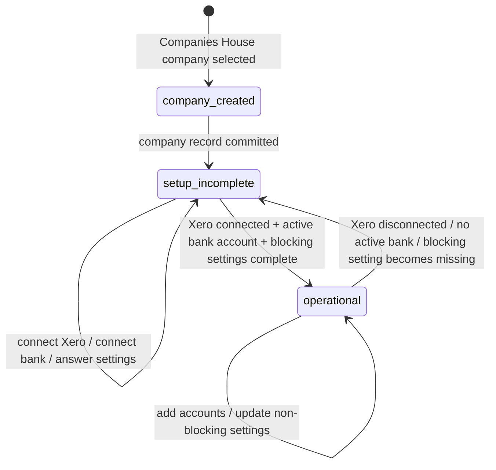
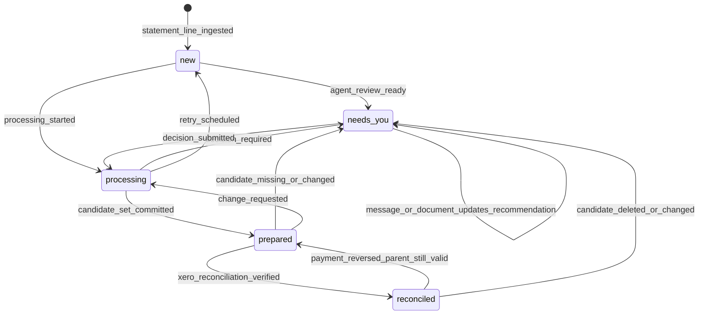
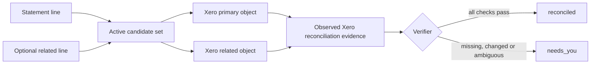

# Workbench lifecycle model

This document separates three concerns that must not be collapsed into one status:

1. company setup readiness;
2. statement-line workflow;
3. Xero candidate lifecycle and reconciliation evidence.

The database stores current projections for fast reads and an append-only event log for audit, replay and debugging. Transitions are event-driven and idempotent.

## 1. Company setup readiness

Companies House selection creates the company immediately. Xero, bank connections and accounting settings are follow-on tasks, not prerequisites for company creation.

`setup_status` is derived, never manually edited:

- `setup_incomplete`: one or more readiness checks fail;
- `operational`: all readiness checks pass.

Navigation rule:

- opening an incomplete company lands on Settings with a visible, ordered checklist;
- opening an operational company lands on its last-opened bank-account feed;
- users may always revisit Settings;
- feed and agent execution are blocked when a blocking readiness check fails.

Validated initial readiness checks:

| Check | Blocks feed/agent | Notes |
|---|---:|---|
| Companies House company selected | yes | The only requirement for creating the company. |
| Xero tenant connected and token usable | yes | Needed to read settings and create/observe candidates. |
| At least one active bank connection or verified statement import | yes | Needed to ingest statement lines. |
| Base currency known and GBP | yes | v1 is UK/GBP only. |
| VAT registration status known | yes | Required to choose tax treatment. |
| VAT scheme known | only when VAT registered | Standard, cash or flat-rate treatment affects decisions. |
| Financial year end known | no initially | Important context, but not required to process ordinary lines. |
| Company UTR / PAYE / CIS attributes | workflow-dependent | Block only an action that requires the missing attribute. |

## 2. Statement-line workflow

Canonical statuses:

| Status | Meaning |
|---|---|
| `new` | Canonical statement line committed after ingestion deduplication; no work claimed. |
| `processing` | A worker holds a renewable lease and is analysing or writing to Xero. |
| `needs_you` | An agent analysis is ready and requires one bookkeeper action: accept a recommendation, provide information or exercise judgement. The detail remains in the raw thread rather than separate status variants. |
| `prepared` | One local active candidate set links this line to valid Xero object(s); Xero does not yet report the relevant payment/transaction as reconciled. |
| `reconciled` | Xero reports the linked candidate as reconciled/paid and correlation plus amount/account checks pass. This is the required settled outcome for every canonical line; later invalidation can reopen it. |

`failed` is not a business status. Retryable and terminal execution failures live on jobs and candidate attempts; a terminal failure returns the line to `needs_you` with a plain-English explanation.

### Transition rules

- Every transition has an `event_id`; duplicate delivery is a no-op.
- `processing` requires a lease (`locked_by`, `lease_expires_at`). An expired lease can be reclaimed.
- Only one active candidate set may be linked to a statement line. One candidate set may link several statement lines when one accounting outcome spans them; the confirmed v1 example is a bank transfer with source and destination lines in different accounts.
- Candidate creation is idempotent on the ordered linked-line IDs, attempt number and object role.
- New Xero bills and sales invoices are created with `AUTHORISED` status. Draft or submitted invoices are not valid prepared candidates in v1.
- `prepared` is entered only after all required Xero objects were created or selected, their returned Xero IDs were stored locally, and correlation markers were written where supported.
- “Open Xero to accept” never changes state. It only opens Xero.
- `reconciled` is entered only from observed Xero data, never from a UI click or elapsed timer.
- Every canonical statement line must reach `reconciled`. Personal/director transactions receive an appropriate accounting treatment such as a director’s loan/current account; they are not removed from bookkeeping.
- Provider retries and duplicate deliveries are collapsed before canonical statement-line creation. If two distinct lines appear on the actual bank statement, both remain canonical and both must be reconciled. A suspected ingestion fault stays `needs_you` until source integrity is resolved.
- Undo is an event, not a field. It is allowed only while the candidate set is safely reversible and no reconciliation evidence exists.
- A reversed bill/invoice payment returns the same line to `prepared` only when the authorised parent document still exists and every fingerprint invariant continues to pass.
- Deletion of a Workbench-created BankTransaction or BankTransfer invalidates the candidate set and moves every linked line to `needs_you`; it is not the same candidate becoming prepared again. The agent may offer to create a new attempt after explaining what changed.
- User edits, deletion, amount drift, account drift or an unexpected matched object otherwise invalidate verification and move the affected line or linked-line group to `needs_you`.

## 3. Candidate sets and reconciliation evidence

Candidate preparation has its own durable sub-state; it is not inferred from the statement-line status:

```mermaid
stateDiagram-v2
  [*] --> creating: reserve request + marker + idempotency key
  creating --> created_in_xero: Xero response received
  creating --> recovery_needed: response or local write is uncertain
  created_in_xero --> recovery_needed: atomic local commit fails
  recovery_needed --> created_in_xero: exact marker and fingerprint recovered
  recovery_needed --> creating: exact lookup empty; retry same reserved request
  created_in_xero --> committed: GUIDs + lines + events + outbox commit atomically
  creating --> committed: Xero response and local commit succeed
```

- `creating`: the immutable request is reserved locally and may be sent to Xero;
- `created_in_xero`: Xero acceptance is known, but the local workflow commit is not yet complete;
- `recovery_needed`: the operation must search Xero by its reserved marker before another create;
- `committed`: all Xero GUID mappings and linked-line transitions committed atomically.

Retries must carry the same SHA-256 accounting-intent fingerprint. A changed contact, ledger account, amount, date, candidate kind or transfer shape is a new decision, never a retry. The Xero key is one persisted UUID; the live API rejected the documentation's 144-character four-UUID example as too long. Marker recovery remains necessary because Xero caches idempotent responses for only six minutes.

A statement line links to zero or one active `candidate_set`. A set links one or more statement lines and owns one or more `xero_objects`:

Examples:

- spend/receive money: one BankTransaction;
- transfer: one shared candidate set linked to the source and destination statement lines, containing one BankTransfer plus the returned source/destination BankTransaction IDs;
- bill or sales invoice: authorised Invoice plus the eventual Payment observed from Xero;
- existing bill/invoice match: selected Invoice plus the eventual Payment;
- split treatment: one BankTransaction with multiple line items, or a documented set of objects if Xero requires it.
- direct Xero reconciliation discovered before analysis: one settled candidate set pointing at the existing reconciled BankTransaction or Payment; the transition evidence records the deterministic ledger fingerprint and contains no agent decision.

### Verification matrix

| Candidate | Prepared evidence | Reconciled evidence | Reverse evidence |
|---|---|---|---|
| BankTransaction | Xero GUID stored; `AUTHORISED`; exact bank account, date and total | same GUID has `IsReconciled=true`, plus invariant checks | Remove & Redo returns `DELETED` and `IsReconciled=false`; candidate set is invalidated |
| BankTransfer | transfer and both bank-transaction GUIDs stored; both linked lines point to the shared set | each line follows its side flag; set is settled only when every required side is true | Remove & Redo on one tested side returned transfer `DELETED` and cleared both flags; invalidate both lines |
| Bill/invoice | Invoice GUID stored; `AUTHORISED`; exact total/contact | parent is `PAID`; fetched Payment is `AUTHORISED`, `IsReconciled=true`, and account/amount/date agree | reversed Payment is `DELETED` and `IsReconciled=false`; valid parent returns to `AUTHORISED`, so line returns to `prepared` |
| Existing bill/invoice | selected Invoice GUID and match rationale stored | same parent and Payment checks as above | same parent-preserving rule when only the payment is reversed |
| Payment/prepayment/overpayment | payment and parent GUIDs stored when present | `IsReconciled=true` and bank account/amount/date checks pass | entity-specific deleted/reversed state invalidates or reopens the parent candidate |

These transitions were observed in the UK demo-company experiment documented in `XERO_CAPABILITY_MATRIX.md`. Xero's public Accounting API does not expose the unreconciled statement line or its ID, so verification proves the linked accounting object's state and fingerprint rather than an API-level join to the bank line.

### Correlation strategy

The local mapping table is authoritative. A Xero-side marker is defence in depth, not the only join.

1. Generate a compact immutable token such as `WB-L-7M4K9P2Q` per statement line.
2. Persist every returned Xero GUID and its role locally in the same database transaction that commits the candidate attempt.
3. Write the token to a supported, non-destructive Xero channel:
   - prefer an app/source URL when the entity exposes one and it does not replace customer data;
   - otherwise append to an optional Reference only when that field is not business-owned and length permits;
   - add a History & Notes entry such as `Prepared by Workbench · WB-L-7M4K9P2Q` where supported;
   - never hide the token in amounts, contact names, invoice numbers or accounting descriptions.
4. On every sync, match by stored Xero GUID first, marker second, and amount/date/payee only as diagnostic evidence—never as the sole identity test.

The per-entity channel mapping belongs in the Xero adapter as a tested capability table. It must be revalidated against Xero API changes before release.

## Events and audit

Minimum event types:

- `statement_line_ingested`
- `processing_started`, `processing_lease_expired`
- `decision_required`, `decision_submitted`
- `document_uploaded`, `document_analysis_completed`, `document_xero_attachment_synced`, `document_xero_attachment_failed`
- `candidate_attempt_started`, `xero_object_created`, `candidate_set_committed`
- `existing_xero_object_validated`, `existing_xero_object_attached`
- `candidate_recovery_required`, `xero_object_reattached`
- `candidate_change_requested`, `candidate_reversed`
- `xero_object_observed`, `xero_payment_discovered`, `xero_reconciliation_verified`, `xero_payment_reversed`, `xero_object_deleted`, `reconciliation_invalidated`

Each event stores actor type/id, company, statement line, correlation/request ID, before/after status, timestamp and structured evidence. Agent prompts, retrieved sources, tool calls and model output live in the private raw line-thread artifact. A preparation event records the deterministic thread path and the validated accounting intent, without copying the reasoning into a second decision record.

Before model analysis or an accepted write, Workbench performs a deterministic Xero-ledger preflight. A movement can settle a line automatically only when mapped bank account, signed amount and date match exactly and both sides of the line-to-movement relation are unique. Same fingerprints shared by multiple lines/movements, an already-linked object, or a same-account/amount movement within seven days are `needs_you`; no candidate is created.

## UI projection rules

- `new`/`processing`: quiet rows; processing shows current activity.
- `needs_you`: prominent card with actions only when choices are safe and complete.
- `needs_you` remains the row state while the bookkeeper obtains or uploads a document; the detail and revised recommendation live in the line panel/thread.
- `prepared`: blue row/run with “Open Xero to accept ↗”; the link has no optimistic state transition.
- `reconciled`: green row/run.
- Lines with unread thread activity stay outside runs. After the activity is read, they may rejoin on the next month boundary; this is a feed projection, not a statement-line status.
