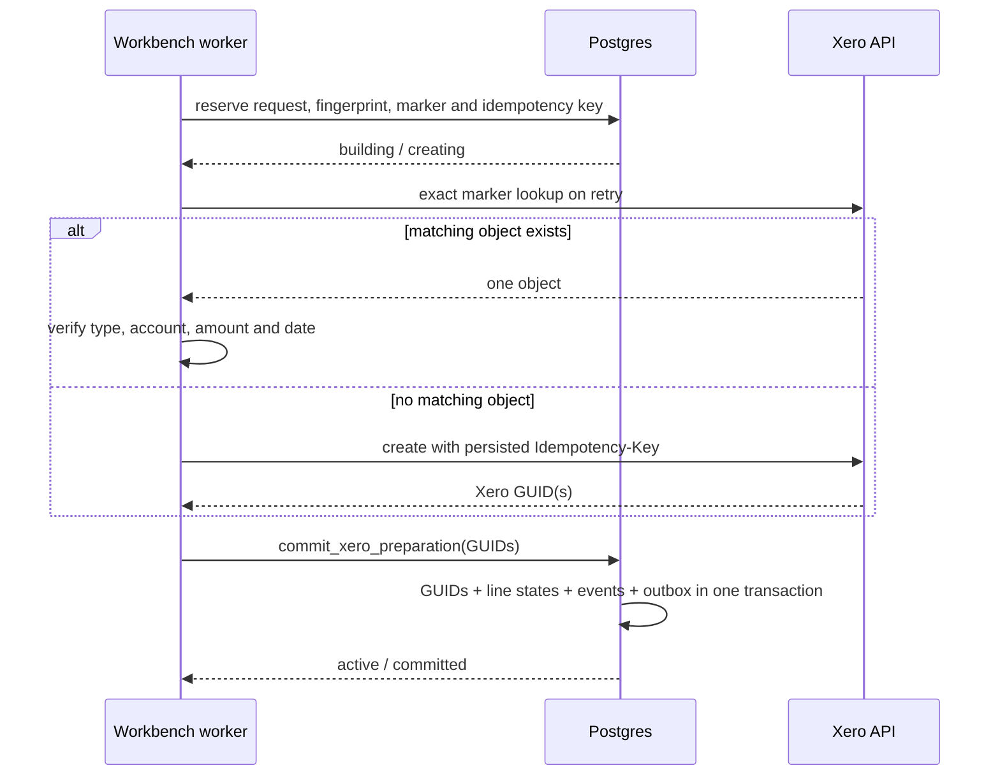

# Xero write recovery

Workbench cannot atomically commit one transaction across Postgres and Xero. Candidate preparation is therefore a recoverable saga with a database-first reservation and an idempotent database commit.

## Invariants

1. A worker reserves the candidate before its first Xero mutation.
2. One live candidate membership per statement line prevents concurrent creates.
3. Retries must reproduce the reserved request and SHA-256 fingerprint exactly.
4. The server derives the local-to-Xero bank-account mapping; the browser cannot select a different Xero bank account in the retry.
5. A reused reservation searches its entity endpoint by exact Workbench Reference before posting.
6. Recovery accepts exactly one live result and verifies the accounting fingerprint. Zero results may be created with the same reserved request; multiple results or a mismatch stop recovery.
7. The native Xero `Idempotency-Key` is a persisted UUID and protects immediate repeated mutations. It is not the durable join because Xero retains keys for only six minutes.
8. `prepared` is visible only after the atomic local commit. `created_in_xero` and `recovery_needed` never masquerade as prepared bookkeeping.

## Entity lookup and verification

| Candidate | Lookup | Required recovery fingerprint | Stored result |
|---|---|---|---|
| BankTransaction | `BankTransactions` exact Reference | marker, SPEND/RECEIVE type, bank account, total, date, non-deleted status | BankTransaction GUID |
| Bill/invoice | `Invoices` exact Reference and `createdByMyApp` | marker, ACCPAY/ACCREC type, total, date, live status | Invoice GUID |
| BankTransfer | `BankTransfers` exact Reference | marker, from/to accounts, total, date, live status and both transaction IDs | BankTransfer plus source/destination BankTransaction GUIDs |

## Failure boundaries

| Failure | Durable state | Retry behaviour |
|---|---|---|
| Before Xero request | `creating` | marker lookup, then create if empty |
| Request outcome unknown | `recovery_needed` | marker lookup; native key covers an immediate repeated POST |
| Xero accepted, receipt stored | `created_in_xero` | marker lookup and reattach |
| Atomic local commit failed | `recovery_needed` | marker lookup and repeat idempotent commit |
| Commit response lost | `committed` | return the same candidate ID without another create |

The live evidence and GUIDs are recorded in `XERO_CAPABILITY_MATRIX.md`. The repeatable guarded harness is `experiments/xero/recovery-experiment.mjs`; select `EXPERIMENT_KIND=bank_transaction`, `bill` or `transfer`. It contains no credentials and reads its temporary failure token and project credentials only from the process environment.
